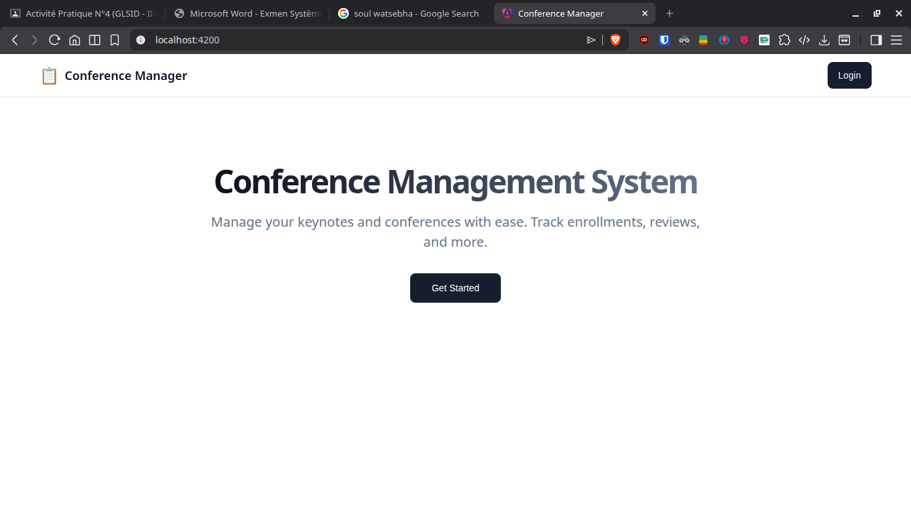
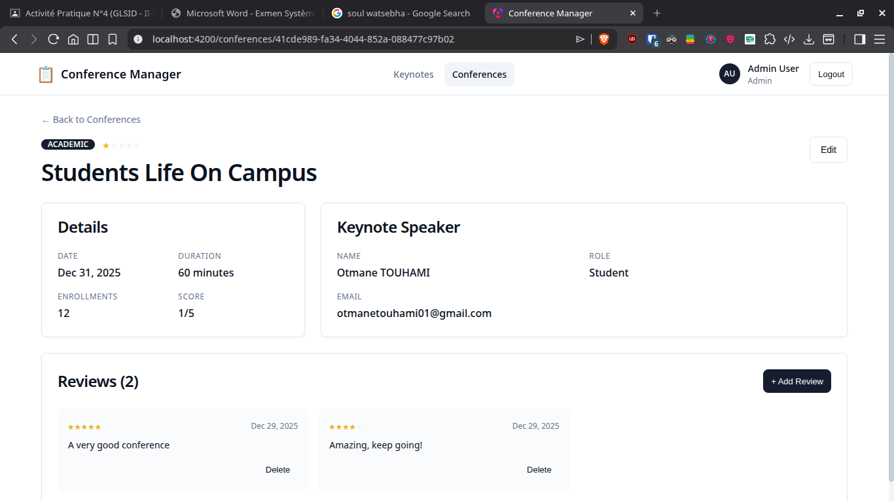
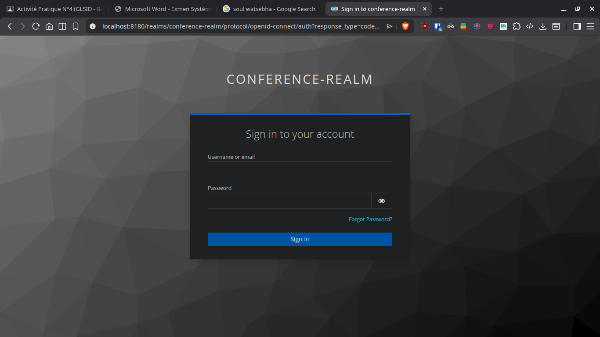

# Conference Management System

A comprehensive Microservices-based application for managing academic conferences, keynote speakers, and reviews. Built with **Spring Boot 3**, **Spring Cloud**, and **Angular 19**.


## 🚀 Features

- **Microservices Architecture**: Decoupled services for scalability.
- **Service Discovery**: Netflix Eureka for dynamic service registration.
- **API Gateway**: Spring Cloud Gateway for centralized routing and CORS handling.
- **Config Management**: Centralized configuration with Spring Cloud Config.
- **Security**: OAuth2/OIDC Authentication with **Keycloak**.
- **Resilience**: Circuit Breakers with **Resilience4j**.
- **Modern Frontend**: Angular 19 with Signals and a responsive UI.
- **Keynote Management**: Specialized service for speaker profiles.
- **Reviews System**: 3-column grid layout for participant feedback.
- **Dockerized**: Full support for Docker Compose deployment.

## 🛠️ Technology Stack

### Backend
- **Java 21**
- **Spring Boot 3.4.1**
- **Spring Cloud 2024.0.0** (Gateway, Config, Eureka, OpenFeign)
- **Spring Security 6** (OAuth2 Resource Server)
- **H2 Database** (In-memory)
- **Resilience4j**

### Frontend
- **Angular 19**
- **TypeScript**
- **Angular Signals**
- **CSS Grid/Flexbox** (Shadcn-inspired design)
- **angular-oauth2-oidc**

### Infrastructure
- **Keycloak 24** (Identity Provider)
- **Docker & Docker Compose**

## 🏗️ Architecture

The system consists of the following services:

| Service | Port | Description |
| :--- | :--- | :--- |
| **Discovery Service** | `8761` | Eureka Service Registry |
| **Config Service** | `9999` | Centralized Configuration Server |
| **Gateway Service** | `8888` | API Gateway (Entry Point) |
| **Conference Service** | `8081` | Core Logic (Conferences, Reviews) |
| **Keynote Service** | `8082` | Speaker Management |
| **Frontend** | `4200` | Angular User Interface |
| **Keycloak** | `8180` | IAM / Authentication |

## 📸 Screenshots

### Landing Page


### Conference Details (with Keynote & Reviews)


### Login (Keycloak)


## 🐳 Running with Docker

The easiest way to run the application is using Docker Compose.

1.  **Prerequisites**: Ensure Docker and Docker Compose are installed.
2.  **Clone the repository**:
    ```bash
    git clone <repository-url>
    cd conference-lab
    ```
3.  **Run with Docker Compose**:
    ```bash
    docker-compose up -d --build
    ```
4.  **Access the Application**:
    - Frontend: [http://localhost:4200](http://localhost:4200)
    - Keycloak Console: [http://localhost:8180](http://localhost:8180) (admin/admin)
    - Eureka Dashboard: [http://localhost:8761](http://localhost:8761)

## 🔧 Manual Setup

If you prefer running services individually (e.g., in IntelliJ IDEA):

1.  **Start Infrastructure**:
    - Start **Keycloak** (using `backend/docker-compose.yml`).
    - Start **Config Service**.
    - Start **Discovery Service**.
2.  **Start Core Services**:
    - Start **Conference Service**.
    - Start **Keynote Service**.
    - Start **Gateway Service**.
3.  **Start Frontend**:
    ```bash
    cd frontend
    pnpm install
    ng serve
    ```

## 👥 Author
**Otmane TOUHAMI**
*Master SDIA - ENSET Mohammedia*
